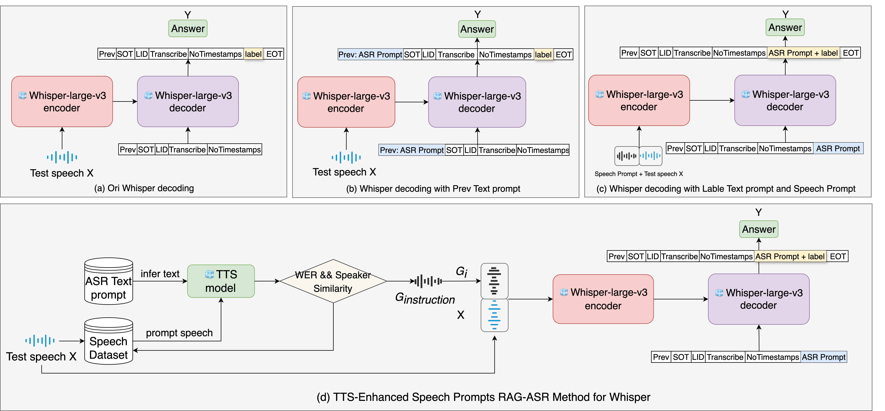

# RAG-ASR

> RAG-ASR for TTS-Enhanced Speech Prompts

### Dataset: English_Accent_DataSet

English Accent DataSet is a 79-hour speech dataset containing 23 different English accents.
The raw audio data files are from [VCTK](https://datashare.ed.ac.uk/handle/10283/2651), [EDACC](https://groups.inf.ed.ac.uk/edacc/) and [Voxpopuli](https://aclanthology.org/2021.acl-long.80/).

>CosyVoice2 0.5B  synthesized speech prompts: https://drive.google.com/file/d/1olok_KbcNH9dxqwglgqY6csWNhlOaBp_/view?usp=drive_link
>
>Audio Dataset: https://drive.google.com/file/d/1PRujCTV8LPXb4H2kfmgmuKVtlhwpRzjt/view?usp=drive_link && https://drive.google.com/file/d/10klZ-U58WPv-l-LFMOnla1PidhvAc-Ya/view?usp=drive_link

(Accents:Dutch German Czech Polish French Hungarian Finnish Romanian Slovak Spanish Italian Estonian Lithuanian Croatian Slovene English Scottish Irish NorthernIrish Indian Vietnamese Canadian American)

- **audio_id**: Unique identifier for each audio file.
- **audio**: The audio data.
- **raw_text**: The raw transcription.
- **gender**: Gender of the speaker.
- **speaker_id**: Identifier for the speaker.
- **accent**: Accent of the speaker.
- **duration**: Duration of the audio file.
- **split**: Split for training, validataion and test.

